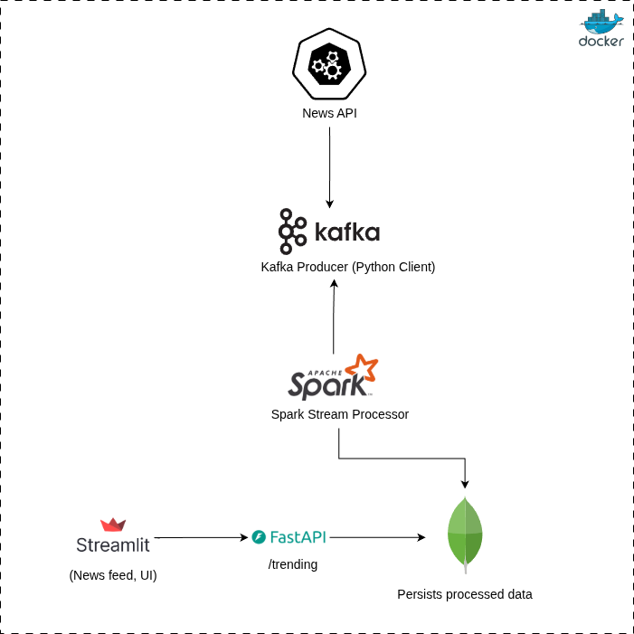

# 📰 News Stream Recommender (Topic Clustering With OpenAI)

> Real-Time NLP Data Pipeline using **Docker**, **FastAPI**, **Kafka**, **Spark**, **MongoDB**, **Streamlit**, and **Poetry**

---

---

## 🧠 Overview

The **News Stream Recommender** continuously ingests breaking news from live sources (NewsAPI), applies NLP topic modeling in real time using **OpenAI**, stores results in **MongoDB**, and visualizes insights via a **FastAPI** + **Streamlit** frontend.

---

## 🚀 Features

- 🌍 **Real-Time Ingestion** – fetches live headlines via Kafka producers  
- 🧩 **Streaming NLP Pipeline** – OpenAI  
- 💾 **Data Persistence** – stores clustered topics in MongoDB  
- ⚡ **RESTful API** – built with FastAPI for frontend data access  
- 📊 **Interactive Dashboard** – live topic view via Streamlit  
- 🐳 **Fully Containerized** – built and orchestrated using Docker Compose  
- 📦 **Poetry-Managed** – clean and reproducible Python environments  

---

## 🏗️ Architecture

---

## ⚙️ Tech Stack

| Layer | Technology |
|-------|-------------|
| Ingestion | **Kafka**, **NewsAPI**, **RSS Feeds** |
| Processing | **Apache Spark** (OPENAI for deterministic mapping between title → topic) |
| Storage | **MongoDB** |
| Backend | **FastAPI** |
| Frontend | **Streamlit** |
| Management | **Docker Compose**, **Poetry** |
